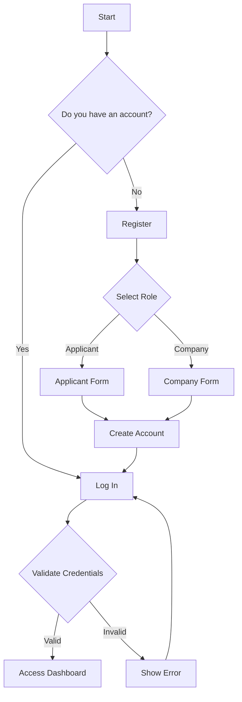
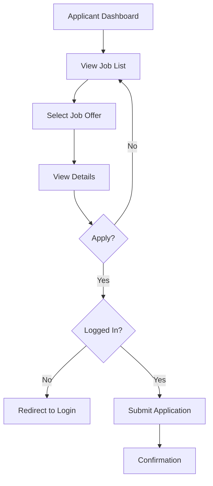
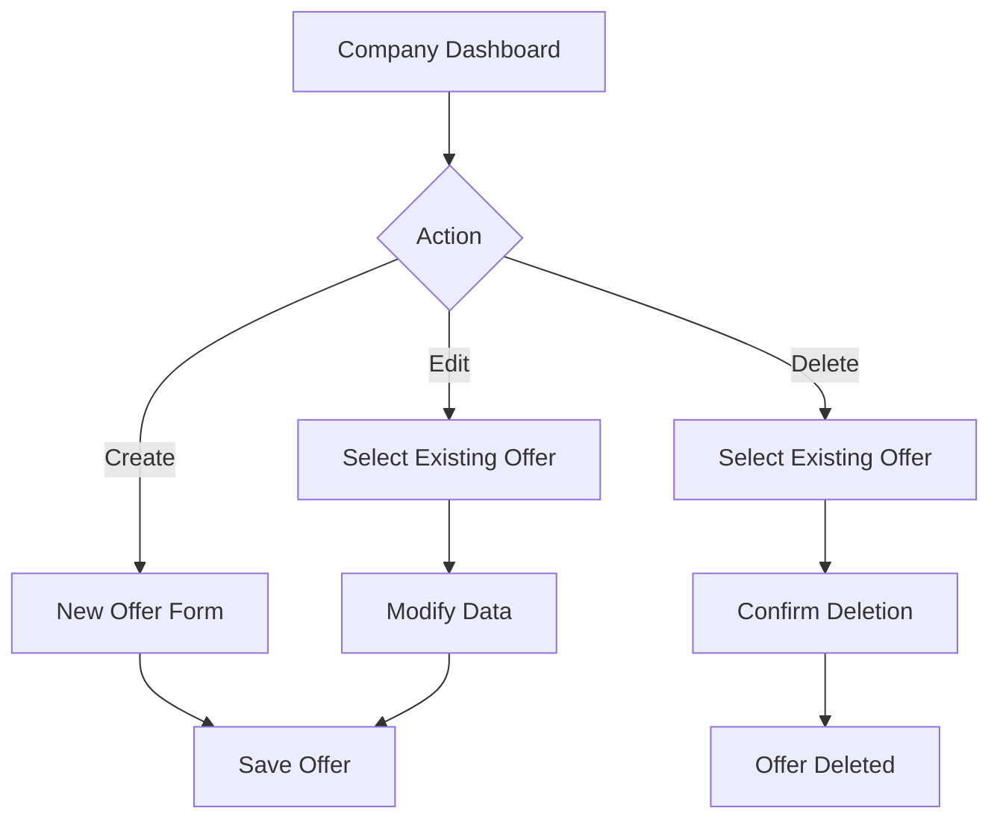
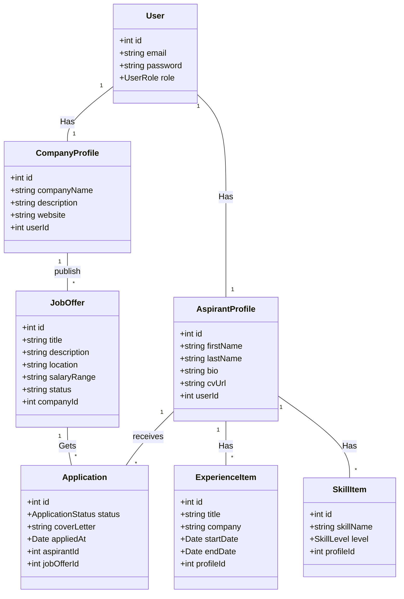

# **Design Documentation - Job Board Project**

## **1. Use Cases**

### **Actors**
- **Applicant**: User looking for a job.
- **Company**: User posting job offers.
- **System**: The job board platform.

### **Main Use Cases**

#### **Actor: Applicant**
1. **Register**: Create an account as an applicant.
2. **Log In**: Access the platform.
3. **Manage Profile**: Create, view, update, and delete their profile (including skills and experience).
4. **View Job Offers**: List and view details of available job offers.
5. **Apply**: Apply to a specific job offer.
6. **View My Applications**: Check the status of their applications.

#### **Actor: Company**
1. **Register**: Create an account as a company.
2. **Log In**: Access the platform.
3. **Manage Company Profile**: Create, view, and update company information.
4. **Manage Job Offers**: Create, view, update, and delete job offers.
5. **View Applications**: See applicants who have applied to their offers.
6. **Manage Application Status**: Change the status of an application (e.g., from "Pending" to "Interview").

---

## **2. Flowcharts**

### **Registration and Login Flow**

### Application Flow (Applicant)

### Job Offer Management Flow (Company)

---

## 3. UML Class Diagram (Backend)

This diagram represents the main entities and their relationships in the database.

[BACK](README_EN.md)
