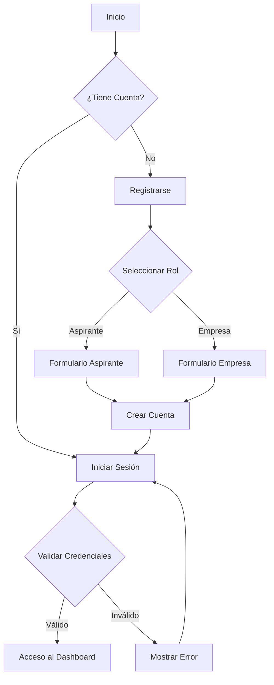
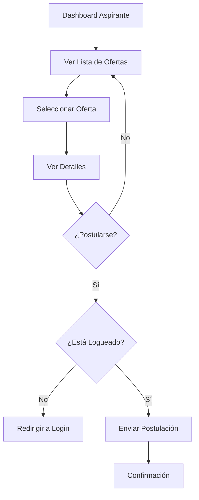
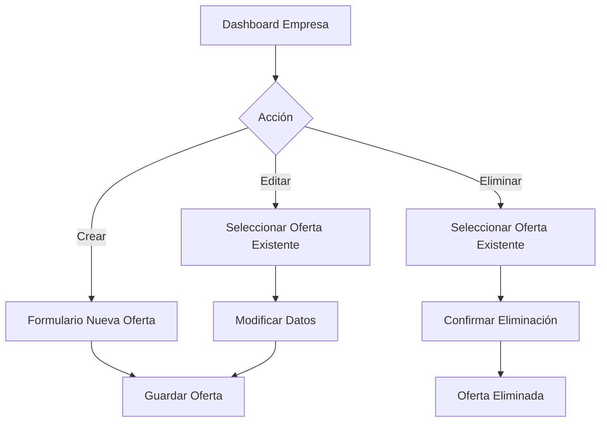
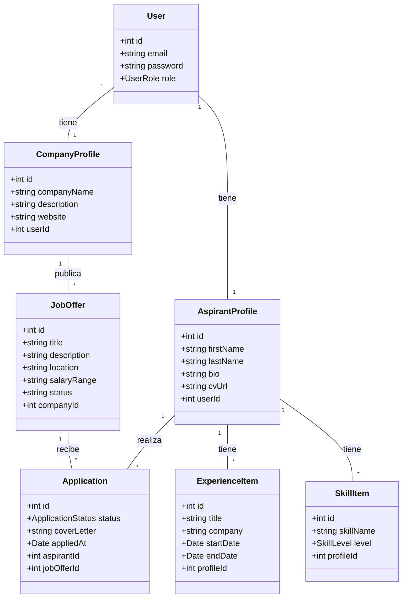

# Documentación de Diseño - Proyecto Bolsa de Empleo

## 1. Casos de Uso

### Actores
- **Aspirante**: Usuario que busca empleo.
- **Empresa**: Usuario que publica ofertas de empleo.
- **Sistema**: La plataforma de bolsa de empleo.

### Casos de Uso Principales

#### Actor: Aspirante
1.  **Registrarse**: Crear una cuenta como aspirante.
2.  **Iniciar Sesión**: Acceder a la plataforma.
3.  **Gestionar Perfil**: Crear, ver, actualizar y eliminar su perfil (incluyendo habilidades y experiencia).
4.  **Ver Ofertas**: Listar y ver detalles de ofertas de trabajo disponibles.
5.  **Postularse**: Aplicar a una oferta de trabajo específica.
6.  **Ver Mis Postulaciones**: Consultar el estado de sus postulaciones.

#### Actor: Empresa
1.  **Registrarse**: Crear una cuenta como empresa.
2.  **Iniciar Sesión**: Acceder a la plataforma.
3.  **Gestionar Perfil de Empresa**: Crear, ver y actualizar la información de la empresa.
4.  **Gestionar Ofertas**: Crear, ver, actualizar y eliminar ofertas de trabajo.
5.  **Ver Postulaciones**: Ver los aspirantes que se han postulado a sus ofertas.
6.  **Gestionar Estado de Postulación**: Cambiar el estado de una postulación (ej: de "Pendiente" a "Entrevista").

---

## 2. Diagramas de Flujo

### Flujo de Registro e Inicio de Sesión

### Flujo de Postulación (Aspirante)

### Flujo de Gestión de Oferta (Empresa)

---

## 3. Diagrama de Clases UML (Backend)

Este diagrama representa las entidades principales y sus relaciones en la base de datos.

[VOLVER](README.md)